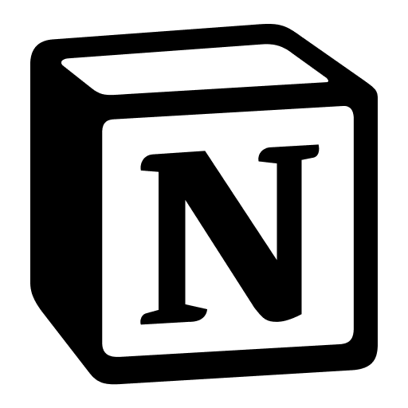

# Notion Todo List for Home Assistant

<p align="center">
  
</p>

[](https://my.home-assistant.io/redirect/hacs_repository/?owner=OldPhoneKiosk&repository=ha_notion_todo_list&category=integration)
[](https://github.com/OldPhoneKiosk/ha_notion_todo_list/actions/workflows/ci.yml)
[](https://github.com/OldPhoneKiosk/ha_notion_todo_list/releases/latest)


Public Home Assistant custom integration that exposes a filtered Notion **database** as a native HA `todo` entity.

This is intended for setups like OldPhoneKiosk where Home Assistant is the source of truth and the phone/tablet only consumes a HA `todo.*` list.

## At a glance

- **Install method:** HACS custom repository using normal release/tag source downloads; no ZIP asset is required.
- **Minimum Home Assistant:** 2025.6.0.
- **Branding:** official Notion icon in `icon.png` and `custom_components/notion_todo_list/icon.png`.
- **Entity model:** one filtered Notion database exposed as a native Home Assistant `todo.*` entity.
- **Automation fit:** use Notion database filters/sorts and HA automations while keeping Notion credentials inside Home Assistant.

## Features

- One config entry = one HA todo list backed by one Notion database.
- Uses Notion's official database query endpoint:
  - `filter_json` is passed as the `filter` object.
  - `sorts_json` is passed as the `sorts` array.
- Supports title, status/done, due date, and description properties.
- Supports Notion `checkbox`, `status`, and `select` properties for completed/not-completed state.
- Create, update, complete, and delete/archiving from HA.
- HACS custom repository layout.

## Install via HACS custom repository

[](https://my.home-assistant.io/redirect/hacs_repository/?owner=OldPhoneKiosk&repository=ha_notion_todo_list&category=integration)

1. Click the HACS badge at the top of this README, or add this repository manually in HACS.
   HACS installs this repository from the selected release/tag source archive; this project intentionally does not require a separate ZIP asset.
2. Download **Notion Todo List**.
3. Restart Home Assistant.
4. Add integration: **Settings → Devices & services → Add integration → Notion Todo List**.

## Notion setup

1. Create a Notion internal integration and copy its secret token.
2. Share the target database with that integration.
3. Copy the database ID.
4. Identify property names, for example:
   - Title property: `Name`
   - Status property: `Done` for checkbox, or `Status` for Notion status/select
   - Due property: `Due`
   - Description property: `Description`

## Filters and sorts

Use exactly the JSON shape from Notion's Database Query API.

Example relation filter:

```json
{
  "property": "Project",
  "relation": {
    "contains": "aaaaaaaa-bbbb-cccc-dddd-eeeeeeeeeeee"
  }
}
```

Example checkbox filter:

```json
{
  "property": "Done",
  "checkbox": {
    "equals": false
  }
}
```

Example compound filter:

```json
{
  "and": [
    {"property": "Done", "checkbox": {"equals": false}},
    {"property": "Assignee", "people": {"contains": "user-id"}}
  ]
}
```

Example sorts:

```json
[
  {"property": "Due", "direction": "ascending"},
  {"timestamp": "created_time", "direction": "descending"}
]
```

## Status property modes

For a checkbox property, use:

- Active status value: `false`
- Completed status value: `true`

For a Notion status/select property, use option names, e.g.:

- Active status value: `Not started`
- Completed status value: `Done`

## Limitations

- Notion API filtering is powerful but expects valid JSON; the integration intentionally does not invent a simplified filter language.
- Delete in HA archives the Notion page.
- If a task is outside your configured filter after an update, it will disappear from the HA list on refresh.

## Development

```bash
python3 -m venv .venv
. .venv/bin/activate
pip install -e '.[dev]'
python -m compileall -q custom_components/notion_todo_list
pytest -q
# Optional HA runtime smoke tests, with Home Assistant + PHACC installed:
pytest tests_ha -q
ruff check .
```
